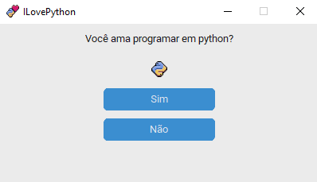
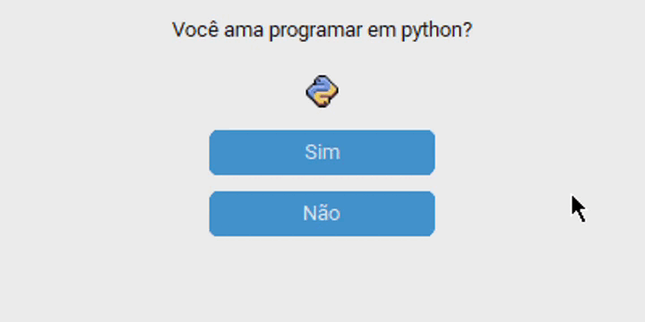

  <h4></h4>
  <figure>
     
    <figcaption>Aba/Interface do ILovePython</figcaption>
  </figure>

  <h3>Sobre o projeto</h3>
  
Criado como uma resenha para brincar com quem não ama a linguagem Python, o ILovePython é um aplicativo com interface simples com objetivo de testar meus conhecimentos em python utilizando o módulo CustomTkinter e brincando com seu sistema de grids, rows e columns.

  

    
    
  

  <h3>Resultado</h3>
  

